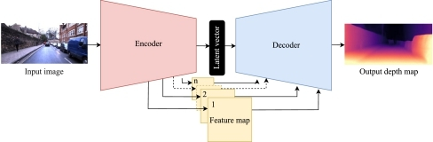

## What about 

The scripts insert in the repository are made for "Deep Learning & Robot perception" exam at "Università degli studi di Perugia". The task was about make depth estimation, from a given dataset in input generated from a virtual world made by Unreal Engine

## The Model

The net is based on encoder-decoder architecture, the encoder side is realized with ResNet50 backbone, instead of the decoder side is made with five transposed convolutional layer to give in output the depth map predicted. 

## Performance
The net is evaluated on two metrics:
- RMSE 
- SSIM

The metrics are generics and in this specific task the most important is the second one, which is an index of similiraties pixel-based. The model is trained using a combined loss weighted on an alpha factor to balanced the importance of the criterions used. 

